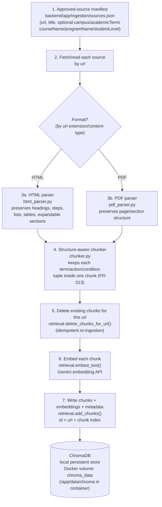
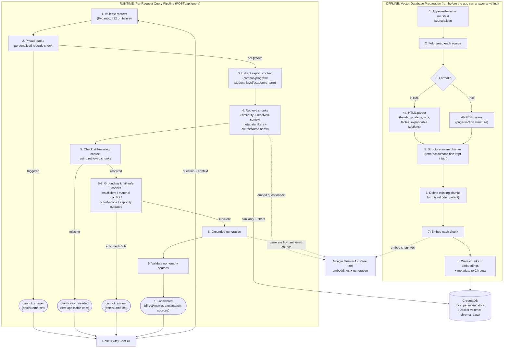

# Implementation Plan: PNW Student Knowledge Chatbot

**Branch**: `001-pnw-student-chatbot` | **Date**: 2026-09-19 (re-simplified) | **Spec**: [spec.md](./spec.md)

**Input**: Feature specification from `/specs/001-pnw-student-chatbot/spec.md`

## Summary

Build a standalone, publicly accessible web chatbot that answers PNW students' natural-language questions about university policies, deadlines, procedures, courses, and programs by retrieving from a curated corpus of approved PNW webpages and PDFs and generating grounded, cited answers. The system fails safely (declines and refers to the appropriate office) when it lacks reliable grounding or the question requires private/personalized data, disambiguates Hammond vs. Westville campus context when it affects the answer, and preserves structured relationships from source documents (deadline-to-term-to-condition, prerequisite-to-course) rather than flattening them.

Technical approach (course-constrained, v1 student project): a FastAPI (Python) backend and a React (Vite) frontend, each running in its own container via Docker Compose (`docker compose up --build`) — `uv` manages the backend's Python environment and `npm` manages the frontend inside their respective images. Retrieval uses a local, file-based ChromaDB vector store (no separate database server to install or run), with its data directory persisted via a Docker volume so ingested content survives container restarts. Generation and embeddings use Google Gemini's free-tier API rather than a paid LLM API. Conversation context (e.g., a resolved campus from a prior clarification) is passed back to the server by the client on each request rather than persisted server-side, keeping the system stateless and simple.

This revision is a simplification pass over the prior design: the persisted model is now a single `SourceChunk` entity, the API returns exactly three response shapes with no unused fields, the audience disclaimer is a static frontend element, ingestion uses a curated approved-source manifest instead of a crawler, and unrequired infrastructure (a performance benchmark, a custom evaluation runner, a second deployment mode, rate-limit-specific machinery) has been removed. No functional requirement changed — see `research.md` for the reasoning behind each simplification.

## Technical Context

**Language/Version**: Python 3.11+ (backend, managed with `uv`); JavaScript (ES2020+) for the frontend via React 18 + Vite (no TypeScript build step, to keep tooling minimal for a v1 student project)

**Primary Dependencies**:
- Backend: FastAPI, Uvicorn, `google-genai` (Gemini SDK, for both generation and embeddings), `chromadb`, `beautifulsoup4` + `pypdf` (ingestion parsing), Pydantic
- Frontend: React 18, Vite, native `fetch` (no extra HTTP client library needed)

**Storage**: ChromaDB running in local persistent mode — a single embedded, file-based vector store (path `/app/data/chroma` inside the backend container, set via `CHROMA_PATH` and persisted through a Docker volume), storing `SourceChunk` text, embeddings, and the small optional metadata set (`campus`, `academicTerm`, `courseName`, `programName`, `studentLevel`) defined in `data-model.md`. No separate database server/container. See `research.md` §4–§5.

**Testing**: `pytest` with FastAPI's `TestClient` for backend unit/contract tests; React Testing Library + Vitest for frontend component tests. No end-to-end browser-automation suite and no performance-benchmark test for v1 — end-to-end behavior and the SC-001–SC-005 evaluation set are instead validated manually via `quickstart.md` (see `research.md` §9–§11).

**Target Platform**: Local/self-hosted, containerized — runs on a student's machine (macOS/Linux/Windows) via `docker compose up --build`, which builds and starts a `backend` container (`uv run --no-sync uvicorn app.main:app --host 0.0.0.0 --port 8000`) and a `frontend` container (Vite dev server on `0.0.0.0:5173`); no cloud deployment and no alternate static-file-serving deployment mode for this version (`research.md` §1, §8).

**Project Type**: Web application — two independently buildable containers, `backend/` (FastAPI) and `frontend/` (React/Vite), talking over a local REST API and orchestrated together by the root `docker-compose.yml`.

**Performance Goals**: No formal performance SLO is defined for v1; the project is designed for local classroom/demo use against a sample corpus, not a latency-sensitive or high-concurrency deployment (`research.md` §10; the interview notes did not provide a performance target — see `spec.md` Assumptions).

**Constraints**: Answers MUST be grounded only in retrieved approved-source context — no open-domain/unsupported generation (FR-004, FR-005); no authentication required, open access with a statically-rendered frontend disclaimer (clarified FR-024); English-language only for this version (per spec Assumptions); MUST operate within Google Gemini's free-tier rate limits — no paid LLM/embedding APIs (course requirement); MUST run via Docker Compose (course requirement), with `uv` and `npm` managing dependencies inside their respective container images

**Scale/Scope**: Course-project pilot scale — a sample corpus on the order of dozens to a few hundred PNW source pages/documents (not an institution-wide crawl) across Hammond and Westville campuses, curated by hand into an approved-source manifest (`research.md` §6); classroom/demo scale, with no explicit concurrency target, since the stakeholder interview notes did not provide one (see `spec.md` Assumptions)

## Constitution Check

*GATE: Must pass before Phase 0 research. Re-check after Phase 1 design.*

`.specify/memory/constitution.md` is ratified at **v2.0.0** (last amended 2026-09-21; a MAJOR-level redefinition of Principle V from "no Docker" to "Docker Compose required" per the course's updated Docker requirement — see the constitution's Sync Impact Report). This plan is checked against each principle/section:

| Principle / Section | Status | Basis |
|---|---|---|
| I. Grounded Answers Only (NON-NEGOTIABLE) | PASS | Generation is constrained to retrieved context only (research.md §2); an `answered` response requires non-empty `sources` (data-model.md) |
| II. Fail Safe, Never Guess | PASS | `backend/app/grounding.py` declines and refers when insufficient/ambiguous/materially-contradictory/private-data/explicitly-outdated-with-no-current-evidence/out-of-scope (tasks.md Phase 4, T034) — a material conflict between approved sources always returns `cannot_answer`, never an `answered` response that picks one side (FR-017); when only an older source's currency is uncertain and newer evidence also supports the answer, that narrower uncertainty is stated in `explanation` instead, never guessed (research.md §5) |
| III. No Private Data, No Login Wall | PASS | No auth anywhere in the design (FR-024); private-data questions are detected and referred, never answered (FR-020) |
| IV. Simplicity Over Engineering Polish | PASS | Single ChromaDB store with one `SourceChunk` entity, no relational database, no crawler, no separate ingestion service, no performance/evaluation infrastructure beyond what's required (research.md §5, §6, §10, §11); two Docker Compose services (backend, frontend) mirror the existing two-project split rather than adding new services |
| V. Containerized, Free-Tier Stack (NON-NEGOTIABLE) | PASS | Docker Compose runs a `backend` container (FastAPI/`uv`) and a `frontend` container (React/npm); Google Gemini free tier only; ChromaDB remains a single embedded store, now persisted via a Docker volume instead of a bare local directory (research.md §1, §4, §8) |
| Content & Context Integrity | PASS | Deadline/prerequisite structure preserved without cross-mixing (FR-013/FR-016) via `structureContext`/`courseName`, with chunk boundaries themselves kept term-safe (tasks.md T059); clarification covers all four missing-context dimensions — campus, program, academic term, and student level (FR-009) — via `backend/app/clarification.py`'s `extract_explicit_context`/`find_missing_context` pair (tasks.md T040, T042, T053–T054, T060–T061); retrieval filters on whichever of those dimensions is resolved, using one eligibility rule across all four — a chunk that omits the field, carries `"both"`, or matches the resolved value stays eligible; only a *different* specific value is excluded, so a context-independent source is never accidentally dropped just because some dimension got resolved (research.md §12; T041 campus, T055 program/student-level, T060 academic term) — separately, T051 boosts on a raw `courseName` mention, independent of resolved context |
| Development Workflow | PASS | Contract/unit tests scheduled per story; `quickstart.md` re-validation required before a touching feature is done |

**Gate result**: PASS.

*Post-Phase-1 re-check*: No change — PASS. This revision's simplifications (single `SourceChunk` entity, three-variant API response, manifest-based ingestion, static disclaimer, no performance/evaluation infrastructure) remove design weight without touching any functional requirement or any Constitution principle's coverage.

*Docker migration re-check (2026-09-21)*: No change — PASS. Moving to Docker Compose as the standard environment (constitution v2.0.0) replaces "no Docker" with "Docker required" in Principle V but does not add a new service, database, or infrastructure component beyond the existing backend/frontend split — the two Compose services map 1:1 onto the two projects that already existed, so Principle IV (Simplicity) still holds.

## Architecture

A single FastAPI service (in a `backend` container) backs a single React app (in a `frontend` container), orchestrated by `docker compose up --build`; there is no separate microservice, message queue, or database server/container. The ingestion pipeline is a CLI entry point inside the same backend codebase, run on-demand inside the `backend` container from a curated approved-source manifest rather than as a running crawler service.

```mermaid
flowchart LR
    UI["React (Vite) Chat UI<br/>(static disclaimer)<br/>frontend container, port 5173"]

    subgraph Backend["FastAPI Backend (uv, backend container, port 8000)"]
        API["POST /api/query"]
        Priv["Private-data safety check<br/>(grounding.py)"]
        Extract["Extract explicit context<br/>(clarification.py:<br/>extract_explicit_context)"]
        Retrieval["Retrieval<br/>similarity + resolved metadata filters"]
        Missing["Missing-context check<br/>(clarification.py:<br/>find_missing_context)"]
        Ground["Grounding &amp; fail-safe check<br/>sufficiency, material conflicts, staleness, out-of-scope"]
        Gen["Gemini grounded generation"]
    end

    Chroma[("ChromaDB<br/>local persistent store<br/>(Docker volume: chroma_data)")]

    subgraph Ingestion["Ingestion Pipeline (offline CLI)"]
        Manifest["Approved-source manifest"]
        Parse["HTML / PDF Parsers"]
        Chunk["Structure-aware Chunker"]
        Embed["Embedder"]
    end

    Gemini["Google Gemini API (free tier)<br/>generation + embeddings"]

    UI -- "question + context" --> API
    API --> Priv
    Priv -- "private data detected" --> API
    Priv -- "not private" --> Extract
    Extract -- "resolved campus/program/<br/>student_level/academic_term" --> Retrieval
    Retrieval -- "embed question" --> Gemini
    Retrieval --> Chroma
    Retrieval --> Missing
    Missing -- "context still missing" --> API
    Missing -- "context resolved" --> Ground
    Ground -- "insufficient / material conflict /<br/>explicitly outdated / out-of-scope" --> API
    Ground -- "sufficient" --> Gen
    Gen -- "generate from retrieved context" --> Gemini
    Gen --> API
    API -- "answered / clarification_needed / cannot_answer" --> UI

    Manifest --> Parse --> Chunk --> Embed
    Embed -- "embed chunks" --> Gemini
    Embed --> Chroma
```



This is the single, authoritative request-handling order (previously duplicated/at risk of drifting between the diagram and tasks.md — now consistent): validate → private-data check → extract explicit context (campus/program/student_level/academic_term, from `context` and/or the question text) → retrieve using whatever was resolved → check the retrieved chunks for still-missing context → clarification (if needed) → grounding/fail-safe check (a material conflict between approved sources on the fact needed to answer always returns `cannot_answer`, never a picked-side `answered`) → generation → response. `tasks.md` T020 states this order in prose for `backend/app/api/query.py`; every task that adds a piece of the pipeline implements into that order rather than redefining it. Both `Extract` and `Missing` above are the same `clarification.py` module (one file, two functions — `extract_explicit_context` and `find_missing_context`), shown as two boxes because they run at two different points in the pipeline, not because there are two modules.

## Vector Database Preparation Workflow

This is the offline pipeline that populates the local ChromaDB store the API queries at request time (the `Ingestion` subgraph in the Architecture diagram above, expanded here as its own workflow since it's a distinct, run-before-the-app-works process rather than a request-time concern). It is triggered manually via a CLI entry point — never by the running API — and is idempotent: re-running it against an unchanged manifest reproduces the same stored chunks rather than duplicating them.



**Steps**:

1. **Curate the manifest** (`backend/app/ingestion/sources.json`) — a hand-maintained list of approved PNW pages/PDFs, not crawler-discovered (`research.md` §6). Each entry supplies `url` and `title` (required); optional known metadata (`campus`, `academicTerm`, `courseName`, `programName`, `studentLevel`) is included only when the curator already knows it — never inferred later in the pipeline. A top-level page's important linked child page or attached document is its own separate manifest entry.
2. **Fetch/read the source** at `url` when the CLI runs.
3. **Parse** with the format-appropriate parser — `html_parser.py` (BeautifulSoup) or `pdf_parser.py` (`pypdf`) — extracting text while preserving the structural relationships FR-013/FR-014/FR-015/FR-016 depend on (heading hierarchy, step order, list membership, table row/column/header association, expandable-section content).
4. **Chunk** the parsed content (`chunker.py`), attaching the manifest entry's `url`/`title`/optional metadata to every resulting chunk, and splitting deadline tables at a boundary that never separates a date from its term/action/condition.
5. **Clear prior chunks for that `url`** before writing new ones, so re-ingesting a source replaces rather than duplicates its chunks.
6. **Embed** each chunk's text via the Gemini embedding API (`retrieval.embed_text()`).
7. **Write** each chunk — text, embedding, and whichever optional metadata fields it carries — into the Chroma collection, with an ID derived from `url` + chunk index (never the bare `url`, since one source produces many chunks).

**Invocation**: `docker compose exec backend uv run python -m app.ingestion.run --manifest app/ingestion/sources.json`, run against the already-running `backend` container (see `quickstart.md`'s "Ingest the approved-source corpus" section for the runnable version, including expected output and how to rebuild the store from scratch). This must be run at least once before the API can answer anything, and re-run whenever the manifest changes.

**Implementation tasks**: `tasks.md` T013–T015 (config, Gemini embed helper, Chroma wrapper — `get_or_create_collection`, `add_chunks`, `delete_chunks_for_url`), T023–T027 (HTML/PDF parsers, manifest loader, chunker, CLI entrypoint), T049–T050 (course/program metadata on chunks), T059 (deadline-table chunk boundaries).

## Complete Workflow (Ingestion + Query, Combined)

The Architecture diagram above and the Vector Database Preparation Workflow diagram each show one half of the system. This diagram puts both halves — the offline ingestion pipeline that must run first, and the runtime query pipeline that runs on every request — in one place, at the same step-by-step detail as each half's own section, sharing the two things they both depend on: the Chroma store and the Gemini API. Numbering matches T020 (query steps) and the Vector Database Preparation Workflow section (ingestion steps) exactly — nothing here redefines either order.



## Project Structure

### Documentation (this feature)

```text
specs/001-pnw-student-chatbot/
├── plan.md              # This file (/speckit-plan command output)
├── research.md          # Phase 0 output (/speckit-plan command)
├── data-model.md         # Phase 1 output (/speckit-plan command)
├── quickstart.md         # Phase 1 output (/speckit-plan command)
├── contracts/            # Phase 1 output (/speckit-plan command)
└── tasks.md              # Phase 2 output (/speckit-tasks command - NOT created by /speckit-plan)
```

### Source Code (repository root)

```text
docker-compose.yml            # Orchestrates the backend + frontend containers (docker compose up --build)

backend/                      # FastAPI application (containerized; uv + uvicorn inside the image)
├── Dockerfile                 # Python 3.12-slim, installs uv, uv sync, runs uvicorn on 0.0.0.0:8000
├── .dockerignore
├── app/
│   ├── main.py                # FastAPI app entrypoint; CORS for the frontend dev origin
│   ├── config.py               # Env/config loader (GEMINI_API_KEY, CHROMA_PATH); shared Gemini client setup
│   ├── api/
│   │   └── query.py              # POST /api/query route — the one place that owns the orchestration order (see contracts/)
│   ├── models.py                  # Pydantic request/response models: QueryRequest, QueryResponse (answered / clarification_needed / cannot_answer)
│   ├── retrieval.py                # Chroma store wrapper + similarity search + campus/program/student-level/academic-term metadata filtering (resolved-context-driven) + a separate raw-text courseName boost
│   ├── generation.py                # Grounded-generation prompt construction and the Gemini generation call
│   ├── grounding.py                  # Private-data detection, insufficient-grounding, conflicting-source, and out-of-scope checks, plus referral-office lookup
│   ├── clarification.py               # Campus, program, student-level, and academic-term disambiguation (FR-009, FR-010) — one module, not one per check
│   └── ingestion/                      # CLI-invoked pipeline: approved-source manifest, HTML/PDF parsers, structure-aware chunker, Gemini embedder
│       ├── sources.json                  # The curated approved-source list/manifest (research.md §6)
│       ├── parsers/
│       │   ├── html_parser.py
│       │   └── pdf_parser.py
│       ├── chunker.py
│       └── run.py                        # CLI entrypoint: uv run python -m app.ingestion.run
├── tests/
│   ├── contract/                   # FastAPI TestClient contract tests for /api/query
│   ├── integration/                 # End-to-end query-flow tests (in-process, no browser)
│   └── unit/                         # Unit tests for retrieval, grounding, clarification, chunking
├── data/
│   └── chroma/                       # Local persistent vector store directory (gitignored; mounted from the chroma_data Docker volume at /app/data/chroma in the container)
├── pyproject.toml                    # uv-managed dependencies
└── .env.example                       # GEMINI_API_KEY, CHROMA_PATH — copy to .env (gitignored) for docker-compose's env_file

frontend/                     # React app (containerized; npm inside the image)
├── Dockerfile                  # Node 22, npm install, runs the Vite dev server on 0.0.0.0:5173
├── .dockerignore
├── src/
│   ├── main.jsx
│   ├── App.jsx
│   ├── components/
│   │   ├── DisclaimerBanner.jsx        # Static audience disclaimer text (FR-024) — not sourced from the API
│   │   ├── AnswerMessage.jsx
│   │   ├── ReferralMessage.jsx
│   │   └── ClarificationPrompt.jsx
│   └── api/
│       └── query.js                    # fetch wrapper for POST /api/query
├── index.html
├── package.json
└── vite.config.js
```

**Structure Decision**: Two simple, independently buildable containers — `backend/` (FastAPI + ChromaDB + Gemini) and `frontend/` (React/Vite), orchestrated by the root `docker-compose.yml` — per the course's explicit requirement to use FastAPI and React (not Next.js) and to run via Docker Compose. The backend is intentionally kept to a small, flat module set (`retrieval.py`, `generation.py`, `grounding.py`, `clarification.py` — one file per concern, not one file per sub-check) rather than the deeper package hierarchy of the prior revision; the ingestion pipeline lives inside `backend/app/ingestion/` as a CLI-invoked module driven by a curated manifest rather than a crawler, and there is a single local vector store (ChromaDB) rather than a separate relational database. See `research.md` for the rationale behind each simplification.

## Complexity Tracking

*The Constitution Check above is a full PASS against the ratified v2.0.0 constitution — no principle is violated, so no complexity justification is required.* This revision removes design weight (fields, modules, a crawler, performance/evaluation infrastructure) that the first design carried without a requirement behind it; it does not introduce any new service, database, or infrastructure, and every functional requirement (FR-001–FR-026) remains covered by the simplified design.
