# Implementation Plan: PNW Student Knowledge Chatbot

**Branch**: `001-pnw-student-chatbot` | **Date**: 2026-09-19 (re-simplified) | **Spec**: [spec.md](./spec.md)

**Input**: Feature specification from `/specs/001-pnw-student-chatbot/spec.md`

## Summary

Build a standalone, publicly accessible web chatbot that answers PNW students' natural-language questions about university policies, deadlines, procedures, courses, and programs by retrieving from a curated corpus of approved PNW webpages and PDFs and generating grounded, cited answers. The system fails safely (declines and refers to the appropriate office) when it lacks reliable grounding or the question requires private/personalized data, disambiguates Hammond vs. Westville campus context when it affects the answer, and preserves structured relationships from source documents (deadline-to-term-to-condition, prerequisite-to-course) rather than flattening them.

Technical approach (course-constrained, v1 student project): a FastAPI (Python) backend and a React (Vite) frontend, run directly on a local machine with no Docker — `uv` manages the backend's Python environment, `npm` manages the frontend. Retrieval uses a local, file-based ChromaDB vector store (no separate database server to install or run). Generation and embeddings use Google Gemini's free-tier API rather than a paid LLM API. Conversation context (e.g., a resolved campus from a prior clarification) is passed back to the server by the client on each request rather than persisted server-side, keeping the system stateless and simple.

This revision is a simplification pass over the prior design: the persisted model is now a single `SourceChunk` entity, the API returns exactly three response shapes with no unused fields, the audience disclaimer is a static frontend element, ingestion uses a curated approved-source manifest instead of a crawler, and unrequired infrastructure (a performance benchmark, a custom evaluation runner, a second deployment mode, rate-limit-specific machinery) has been removed. No functional requirement changed — see `research.md` for the reasoning behind each simplification.

## Technical Context

**Language/Version**: Python 3.11+ (backend, managed with `uv`); JavaScript (ES2020+) for the frontend via React 18 + Vite (no TypeScript build step, to keep tooling minimal for a v1 student project)

**Primary Dependencies**:
- Backend: FastAPI, Uvicorn, `google-genai` (Gemini SDK, for both generation and embeddings), `chromadb`, `beautifulsoup4` + `pypdf` (ingestion parsing), Pydantic
- Frontend: React 18, Vite, native `fetch` (no extra HTTP client library needed)

**Storage**: ChromaDB running in local persistent mode — a single embedded, file-based vector store (default path `backend/data/chroma/`), storing `SourceChunk` text, embeddings, and the small optional metadata set (`campus`, `academicTerm`, `courseName`, `programName`, `studentLevel`) defined in `data-model.md`. No database server process, no Docker. See `research.md` §4–§5.

**Testing**: `pytest` with FastAPI's `TestClient` for backend unit/contract tests; React Testing Library + Vitest for frontend component tests. No end-to-end browser-automation suite and no performance-benchmark test for v1 — end-to-end behavior and the SC-001–SC-005 evaluation set are instead validated manually via `quickstart.md` (see `research.md` §9–§11).

**Target Platform**: Local/self-hosted — runs directly on a student's machine (macOS/Linux/Windows) via `uv run uvicorn app.main:app --reload` (backend) and `npm run dev` (frontend); no containerization, no cloud deployment, and no alternate static-file-serving deployment mode for this version (`research.md` §1, §8).

**Project Type**: Web application — two independently runnable local projects, `backend/` (FastAPI) and `frontend/` (React/Vite), talking over a local REST API.

**Performance Goals**: No formal performance SLO is defined for v1; the project is designed for local classroom/demo use against a sample corpus, not a latency-sensitive or high-concurrency deployment (`research.md` §10; the interview notes did not provide a performance target — see `spec.md` Assumptions).

**Constraints**: Answers MUST be grounded only in retrieved approved-source context — no open-domain/unsupported generation (FR-004, FR-005); no authentication required, open access with a statically-rendered frontend disclaimer (clarified FR-024); English-language only for this version (per spec Assumptions); MUST operate within Google Gemini's free-tier rate limits — no paid LLM/embedding APIs (course requirement); MUST run without Docker, using only a native Python (`uv`) + Node/npm environment

**Scale/Scope**: Course-project pilot scale — a sample corpus on the order of dozens to a few hundred PNW source pages/documents (not an institution-wide crawl) across Hammond and Westville campuses, curated by hand into an approved-source manifest (`research.md` §6); classroom/demo scale, with no explicit concurrency target, since the stakeholder interview notes did not provide one (see `spec.md` Assumptions)

## Constitution Check

*GATE: Must pass before Phase 0 research. Re-check after Phase 1 design.*

`.specify/memory/constitution.md` is ratified at **v1.0.1** (last amended 2026-09-19; a PATCH-level wording clarification to Principle II — see the constitution's Sync Impact Report). This plan is checked against each principle/section:

| Principle / Section | Status | Basis |
|---|---|---|
| I. Grounded Answers Only (NON-NEGOTIABLE) | PASS | Generation is constrained to retrieved context only (research.md §2); an `answered` response requires non-empty `sources` (data-model.md) |
| II. Fail Safe, Never Guess | PASS | `backend/app/grounding.py` declines and refers when insufficient/ambiguous/materially-contradictory/private-data/explicitly-outdated-with-no-current-evidence/out-of-scope (tasks.md Phase 4, T030) — a material conflict between approved sources always returns `cannot_answer`, never an `answered` response that picks one side (FR-017); when only an older source's currency is uncertain and newer evidence also supports the answer, that narrower uncertainty is stated in `explanation` instead, never guessed (research.md §5) |
| III. No Private Data, No Login Wall | PASS | No auth anywhere in the design (FR-024); private-data questions are detected and referred, never answered (FR-020) |
| IV. Simplicity Over Engineering Polish | PASS | Single ChromaDB store with one `SourceChunk` entity, no relational database, no crawler, no separate ingestion service, no performance/evaluation infrastructure beyond what's required (research.md §5, §6, §10, §11) |
| V. Local-First, Free-Tier Stack (NON-NEGOTIABLE) | PASS | FastAPI/`uv` + React/npm, no Docker, Google Gemini free tier only, ChromaDB local persistent store (research.md §1–4, §8) |
| Content & Context Integrity | PASS | Deadline/prerequisite structure preserved without cross-mixing (FR-013/FR-016) via `structureContext`/`courseName`, with chunk boundaries themselves kept term-safe (tasks.md T055); clarification covers all four missing-context dimensions — campus, program, academic term, and student level (FR-009) — via `backend/app/clarification.py`'s `extract_explicit_context`/`find_missing_context` pair (tasks.md T036, T038, T049–T050, T056–T057); retrieval filters on whichever of those dimensions is resolved (T037 campus, T051 program/student-level, T056 academic term) — separately, T047 boosts on a raw `courseName` mention, independent of resolved context |
| Development Workflow | PASS | Contract/unit tests scheduled per story; `quickstart.md` re-validation required before a touching feature is done |

**Gate result**: PASS.

*Post-Phase-1 re-check*: No change — PASS. This revision's simplifications (single `SourceChunk` entity, three-variant API response, manifest-based ingestion, static disclaimer, no performance/evaluation infrastructure) remove design weight without touching any functional requirement or any Constitution principle's coverage.

## Architecture

A single local FastAPI service backs a single local React app; there is no separate microservice, message queue, or database server. The ingestion pipeline is a CLI entry point inside the same backend codebase, run offline/on-demand from a curated approved-source manifest rather than as a running crawler service.

```mermaid
flowchart LR
    UI["React (Vite) Chat UI<br/>(static disclaimer)"]

    subgraph Backend["FastAPI Backend (uv, local, no Docker)"]
        API["POST /api/query"]
        Priv["Private-data safety check<br/>(grounding.py)"]
        Extract["Extract explicit context<br/>(clarification.py:<br/>extract_explicit_context)"]
        Retrieval["Retrieval<br/>similarity + resolved metadata filters"]
        Missing["Missing-context check<br/>(clarification.py:<br/>find_missing_context)"]
        Ground["Grounding &amp; fail-safe check<br/>sufficiency, material conflicts, staleness, out-of-scope"]
        Gen["Gemini grounded generation"]
    end

    Chroma[("ChromaDB<br/>local persistent store")]

    subgraph Ingestion["Ingestion Pipeline (offline CLI)"]
        Manifest["Approved-source manifest"]
        Parse["HTML / PDF Parsers"]
        Chunk["Structure-aware Chunker"]
        Embed["Embedder"]
    end

    Gemini["Google Gemini API (free tier)<br/>generation + embeddings"]

    UI -- "question + context" --> API
    API --> Priv
    Priv -- "private data detected" --> API
    Priv -- "not private" --> Extract
    Extract -- "resolved campus/program/<br/>student_level/academic_term" --> Retrieval
    Retrieval -- "embed question" --> Gemini
    Retrieval --> Chroma
    Retrieval --> Missing
    Missing -- "context still missing" --> API
    Missing -- "context resolved" --> Ground
    Ground -- "insufficient / material conflict /<br/>explicitly outdated / out-of-scope" --> API
    Ground -- "sufficient" --> Gen
    Gen -- "generate from retrieved context" --> Gemini
    Gen --> API
    API -- "answered / clarification_needed / cannot_answer" --> UI

    Manifest --> Parse --> Chunk --> Embed
    Embed -- "embed chunks" --> Gemini
    Embed --> Chroma
```



This is the single, authoritative request-handling order (previously duplicated/at risk of drifting between the diagram and tasks.md — now consistent): validate → private-data check → extract explicit context (campus/program/student_level/academic_term, from `context` and/or the question text) → retrieve using whatever was resolved → check the retrieved chunks for still-missing context → clarification (if needed) → grounding/fail-safe check (a material conflict between approved sources on the fact needed to answer always returns `cannot_answer`, never a picked-side `answered`) → generation → response. `tasks.md` T016 states this order in prose for `backend/app/api/query.py`; every task that adds a piece of the pipeline implements into that order rather than redefining it. Both `Extract` and `Missing` above are the same `clarification.py` module (one file, two functions — `extract_explicit_context` and `find_missing_context`), shown as two boxes because they run at two different points in the pipeline, not because there are two modules.

## Project Structure

### Documentation (this feature)

```text
specs/001-pnw-student-chatbot/
├── plan.md              # This file (/speckit-plan command output)
├── research.md          # Phase 0 output (/speckit-plan command)
├── data-model.md         # Phase 1 output (/speckit-plan command)
├── quickstart.md         # Phase 1 output (/speckit-plan command)
├── contracts/            # Phase 1 output (/speckit-plan command)
└── tasks.md              # Phase 2 output (/speckit-tasks command - NOT created by /speckit-plan)
```

### Source Code (repository root)

```text
backend/                      # FastAPI application (run with uv + uvicorn, no Docker)
├── app/
│   ├── main.py                # FastAPI app entrypoint; CORS for the frontend dev origin
│   ├── config.py               # Env/config loader (GEMINI_API_KEY, CHROMA_PATH); shared Gemini client setup
│   ├── api/
│   │   └── query.py              # POST /api/query route — the one place that owns the orchestration order (see contracts/)
│   ├── models.py                  # Pydantic request/response models: QueryRequest, QueryResponse (answered / clarification_needed / cannot_answer)
│   ├── retrieval.py                # Chroma store wrapper + similarity search + campus/program/student-level/academic-term metadata filtering (resolved-context-driven) + a separate raw-text courseName boost
│   ├── generation.py                # Grounded-generation prompt construction and the Gemini generation call
│   ├── grounding.py                  # Private-data detection, insufficient-grounding, conflicting-source, and out-of-scope checks, plus referral-office lookup
│   ├── clarification.py               # Campus, program, student-level, and academic-term disambiguation (FR-009, FR-010) — one module, not one per check
│   └── ingestion/                      # CLI-invoked pipeline: approved-source manifest, HTML/PDF parsers, structure-aware chunker, Gemini embedder
│       ├── sources.json                  # The curated approved-source list/manifest (research.md §6)
│       ├── parsers/
│       │   ├── html_parser.py
│       │   └── pdf_parser.py
│       ├── chunker.py
│       └── run.py                        # CLI entrypoint: uv run python -m app.ingestion.run
├── tests/
│   ├── contract/                   # FastAPI TestClient contract tests for /api/query
│   ├── integration/                 # End-to-end query-flow tests (in-process, no browser)
│   └── unit/                         # Unit tests for retrieval, grounding, clarification, chunking
├── data/
│   └── chroma/                       # Local persistent vector store directory (gitignored)
├── pyproject.toml                    # uv-managed dependencies
└── .env.example                       # GEMINI_API_KEY, etc.

frontend/                     # React app (run with npm, no Docker)
├── src/
│   ├── main.jsx
│   ├── App.jsx
│   ├── components/
│   │   ├── DisclaimerBanner.jsx        # Static audience disclaimer text (FR-024) — not sourced from the API
│   │   ├── AnswerMessage.jsx
│   │   ├── ReferralMessage.jsx
│   │   └── ClarificationPrompt.jsx
│   └── api/
│       └── query.js                    # fetch wrapper for POST /api/query
├── index.html
├── package.json
└── vite.config.js
```

**Structure Decision**: Two simple, independently runnable local projects — `backend/` (FastAPI + ChromaDB + Gemini) and `frontend/` (React/Vite) — per the course's explicit requirement to use FastAPI and React (not Next.js) and to avoid Docker. The backend is intentionally kept to a small, flat module set (`retrieval.py`, `generation.py`, `grounding.py`, `clarification.py` — one file per concern, not one file per sub-check) rather than the deeper package hierarchy of the prior revision; the ingestion pipeline lives inside `backend/app/ingestion/` as a CLI-invoked module driven by a curated manifest rather than a crawler, and there is a single local vector store (ChromaDB) rather than a separate relational database. See `research.md` for the rationale behind each simplification.

## Complexity Tracking

*The Constitution Check above is a full PASS against the ratified v1.0.1 constitution — no principle is violated, so no complexity justification is required.* This revision removes design weight (fields, modules, a crawler, performance/evaluation infrastructure) that the first design carried without a requirement behind it; it does not introduce any new service, database, or infrastructure, and every functional requirement (FR-001–FR-026) remains covered by the simplified design.
